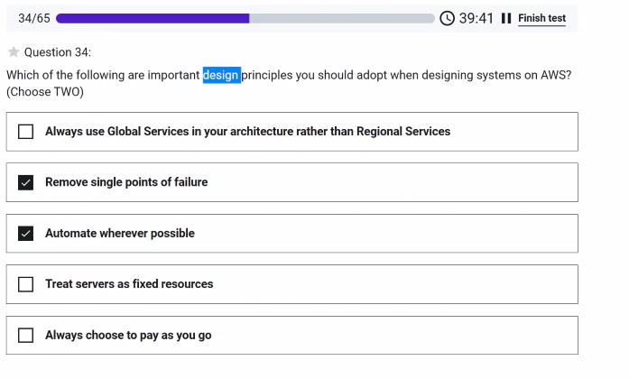

elastic mass reduce

Snowmobile - big semi will back up with ton of storage

VPC - is what your EC2 instances are connected to. VPC security allows you to control Network Access Control Lists

Elastic Containerized Service

AWS - Personal Health Dashboard - just your services
Service Heatlh - general dashboard

- dedicated instances running on dedicated hosts

You want to treat services as not fixed, you want to tear down as needed 

